# 02 - Schéma de la chaîne CICD

## Schéma logique

```mermaid
flowchart TD
    A[👨‍💻 Développeur\npush sur GitHub] --> B

    subgraph CI ["🔧 01-ci.yml — Intégration Continue"]
        B[Checkout du code] --> C[Vérification des fichiers]
        C --> D[Validation compose.yml]
        D --> E[Build image Docker]
        E --> F[Test HTTP automatisé\ncurl / et /version.json]
    end

    F --> G

    subgraph CD ["📦 02-publish-ghcr.yml — Publication"]
        G[Connexion GHCR\nGITHUB_TOKEN] --> H[Build + Push image]
        H --> I[Tag sha-xxxxxxx\nTag latest]
        I --> J[Digest sha256:...]
    end

    J --> K

    subgraph PROMOTE ["🚀 03-promote.yml — Promotion manuelle"]
        K[workflow_dispatch\nsource_tag=latest] --> L

        subgraph ENV1 ["Environnement: recette"]
            L[Pull image existante\nsans rebuild] --> M[Test HTTP recette]
        end

        M --> N

        subgraph ENV2 ["Environnement: production-simulee"]
            N[docker tag\nproduction-simulee] --> O[Push tag\nproduction-simulee]
        end
    end

    style CI fill:#1a3a5c,stroke:#4a9eff
    style CD fill:#1a4a2e,stroke:#4aff7a
    style PROMOTE fill:#4a2a1a,stroke:#ff9a4a
    style ENV1 fill:#2a2a4a,stroke:#9a9aff
    style ENV2 fill:#4a2a2a,stroke:#ff9a9a
```



## Explication de chaque étape

**Étape 1 — 01-ci.yml : Build et test**
À chaque push ou pull request, GitHub Actions construit automatiquement l'image Docker à partir du Dockerfile. Un conteneur est lancé et deux tests HTTP vérifient que le site répond correctement sur / et /version.json.

**Étape 2 — 02-publish-ghcr.yml : Publication GHCR**
Lors d'un push sur la branche main, l'image est construite et publiée dans GitHub Container Registry. Deux tags sont créés : un tag sha- unique lié au commit, et le tag latest.

**Étape 3 — 03-promote.yml : Validation recette et promotion**
Ce workflow est déclenché manuellement. Il télécharge l'image déjà publiée sans rebuild, la teste dans un environnement recette simulé, puis la promeut vers production-simulee en ajoutant un nouveau tag sur la même image.

## Orchestration légère avec Docker Compose

Le fichier compose.yml décrit trois services :
- **web** : le serveur Nginx qui sert le site statique
- **tester** : un conteneur curl qui vérifie automatiquement les URLs au démarrage
- **whoami** : un service secondaire qui illustre la coordination de plusieurs conteneurs

Docker Compose joue le rôle d'orchestrateur léger : il gère les dépendances entre services, le réseau partagé et le cycle de vie des conteneurs.

## Simulation de scaling

```bash
docker compose up -d --scale web=2
```

Résultat obtenu : 2 instances web + 1 whoami + 1 tester = 4 conteneurs simultanés sur le réseau cicd_net.

## Comparaison avec Kubernetes et une vraie production

| Critère | Docker Compose (ce projet) | Kubernetes (production réelle) |
|---|---|---|
| **Orchestration** | Locale, mono-hôte | Distribuée, multi-nœuds |
| **Haute disponibilité** | Non — si l'hôte tombe, tout tombe | Oui — les pods sont redistribués |
| **Load balancing** | Non — pas de répartition de charge | Oui — Service + Ingress intégrés |
| **Scaling automatique** | Manuel uniquement | HorizontalPodAutoscaler automatique |
| **Rollback** | Manuel avec docker tag | Automatique avec kubectl rollout undo |
| **Supervision** | Aucune intégrée | Prometheus, Grafana, alerting |
| **Gestion des secrets** | Variables locales | Kubernetes Secrets + Vault |
| **Déploiement continu** | Simulation manuelle | ArgoCD, FluxCD, pipelines natifs |

En production réelle avec Kubernetes, le même pipeline CI/CD publierait l'image dans GHCR, puis un opérateur GitOps (ArgoCD) détecterait le nouveau digest et déploierait automatiquement sur le cluster en respectant une politique de déploiement (rolling update, canary, blue/green).

## Limite importante

Docker Compose est parfaitement adapté au développement local et aux démonstrations pédagogiques. Il ne convient pas à une production réelle car il ne gère pas : la haute disponibilité, la répartition de charge, la supervision, le scaling automatique, ni la séparation stricte des environnements.
