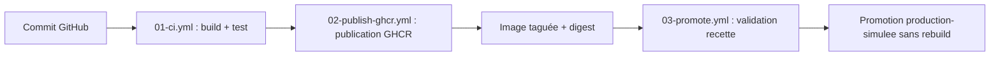

# 02 - Schéma de la chaîne CICD

## Schéma logique

## Explication de chaque étape

**Étape 1 — 01-ci.yml : Build et test**
À chaque push ou pull request, GitHub Actions construit automatiquement l'image Docker à partir du Dockerfile. Un conteneur est lancé et deux tests HTTP vérifient que le site répond correctement sur / et /version.json.

**Étape 2 — 02-publish-ghcr.yml : Publication GHCR**
Lors d'un push sur la branche main, l'image est construite et publiée dans GitHub Container Registry (GHCR). Deux tags sont créés : un tag sha- unique lié au commit, et le tag latest.

**Étape 3 — 03-promote.yml : Validation recette et promotion**
Ce workflow est déclenché manuellement. Il télécharge l'image déjà publiée (sans rebuild), la teste dans un environnement recette simulé, puis la promeut vers production-simulee en ajoutant un nouveau tag sur la même image.

## Orchestration légère

Le fichier compose.yml décrit trois services : web (Nginx), tester (curl) et whoami. Il sert à documenter et simuler une coordination de conteneurs, sans prétendre remplacer une orchestration de production.

## Limite importante

Docker Compose est utile pour une mise en situation pédagogique. En production réelle, il faudrait traiter : haute disponibilité, répartition de charge, supervision, politique de déploiement, rollback, sécurité et sauvegarde.
